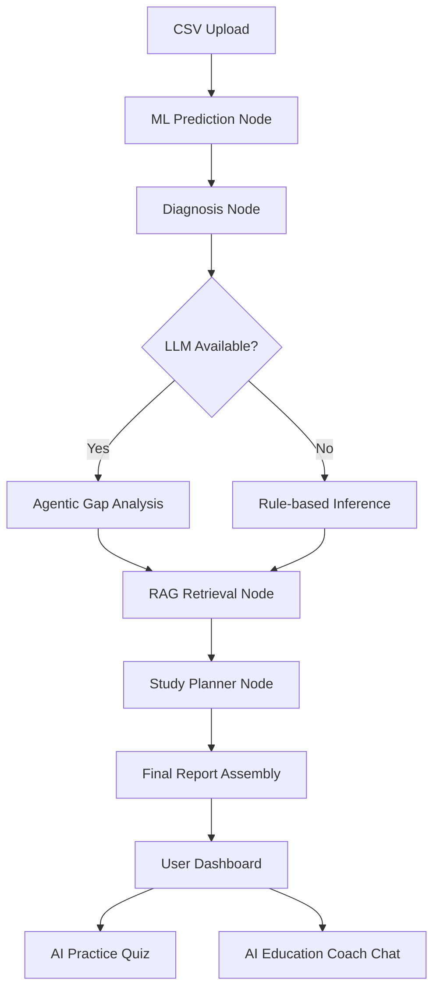

# VectoSpace · Agentic AI Education Coach

VectoSpace is a production-grade educational intelligence platform that transforms raw student data into **autonomous, personalized learning journeys**. Moving beyond simple grade prediction, it leverages an **Agentic AI Orchestration** layer to diagnose learning gaps, retrieve targeted resources via **RAG**, and generate interactive study plans.

---

## Key Features

| Feature                      | Description                                                                             | Tech Stack                    |
| :--------------------------- | :-------------------------------------------------------------------------------------- | :---------------------------- |
| **Academic Prediction**   | Classifies student performance (Grade 0–5) using Random Forest.                         | Scikit-Learn, Pandas          |
| **Status Classification** | At-Risk → Below-Average → Average → Above-Average → High-Performing → Exceptional       | Rule-based                    |
| **Agentic Diagnosis**     | LLM-powered (or rule-based) learning gap analysis against student goals                 | LangGraph, Groq/Gemini/GPT-4o |
| **Goal Alignment**        | Determines if a student is Aligned / Partially Aligned / Misaligned with their goals    | Rule + LLM                    |
| **Severity Scoring**      | Gaps rated Critical / Moderate / Minor with evidence and recommendations                | Rule + LLM                    |
| **Confidence Score**      | Data completeness score penalised for missing key fields                                | Rule-based                    |
| **RAG Discovery**         | Semantic search across educational datasets to find targeted learning materials.        | FAISS, Sentence-Transformers  |
| **Study Planner**         | Generates structured, multi-week study calendars tailored to student gaps.              | LangGraph                     |
| **Practice Quizzes**      | AI-generated interactive assessments based on identified gaps and RAG resources.        | Llama-3.1, Streamlit          |
| **AI Coach Chat**         | Conversational interface for students to interact with their diagnosis and study plans. | Groq (Llama-3.1-8B)           |
| **Professional Exports**  | Automated PDF generation of comprehensive student success reports.                      | FPDF                          |

---

##  Architecture

VectoSpace implements a sophisticated **Agentic Workflow** using `LangGraph`.



### Core Components
- **ML Engine**: Pre-trained Random Forest classifier for high-accuracy grade projection.
- **Inference Layer**: Dual-mode (Rule-based + LLM) for robustness; falls back to deterministic rules if API keys are missing.
- **Vector Store**: FAISS index containing curated educational resources for RAG-driven recommendations.
- **Orchestrator**: LangGraph manages the state transition from raw performance data to a validated Pydantic FinalReport.

##  Diagnosis Engine
```text
student_goals + performance_data
        ↓
Rule-based Engine (always runs)
        ↓
LLM (optional enhancement)
        ↓
Schema Validation
        ↓
Diagnosis Report
```

## Prompt Strategy

`agent/prompts.py` implements a multi-layer prompt safety strategy:

| Strategy | Implementation |
| :--- | :--- |
| Role priming | System prompt defines model as an "expert educational diagnostician" |
| Schema enforcement | Exact JSON structure specified with types; model outputs strict JSON |
| Few-shot prompting | 2 labelled examples: one At-Risk, one High-Performing |
| Negative anchoring | Ensures model outputs [] gaps when appropriate |
| Guardrails | Prevent hallucination, enforce structure |
| Uncertainty hedging | `confidence_score` penalised for missing data |

## DiagnosisReport Schema
```json
{
  "student_id": "STU007",
  "student_name": "Dev Patel",
  "overall_status": "At-Risk",
  "predicted_grade": "Grade 1",
  "goal_alignment": "Misaligned",
  "learning_gaps": [
    {
      "area": "Mathematics",
      "severity": "Critical",
      "evidence": "Math score is below threshold",
      "recommendations": ["...", "...", "..."]
    }
  ],
  "strengths": ["Science score is strong"],
  "priority_actions": ["Improve attendance"],
  "confidence_score": 0.9,
  "diagnosis_notes": "Multiple gaps detected",
  "source": "rule-based"
}
```

## Project Structure
```text
VectoSpace/
├── app.py
├── agent/
│   ├── diagnosis.py
│   ├── planner.py
│   └── prompts.py
├── src/
│   ├── agent/
│   │   ├── graph.py
│   │   ├── state.py
│   │   └── schema.py
│   └── ml/
│       ├── train.py
│       ├── retrain.py
│       ├── recommender.py
│       └── utils.py
├── rag/
│   ├── retriever.py
│   └── vectorstore_setup.py
├── extensions/
│   ├── quiz_generator.py
│   └── pdf_export.py
├── datasets/
├── model_artifacts/
├── notebooks/
├── requirements.txt
└── README.md
```

## Setup & Installation
```bash
git clone https://github.com/crazylogic03/VectoSpace.git
cd VectoSpace

python3 -m venv venv
source venv/bin/activate

pip install -r requirements.txt
```

### API Keys
```env
GROQ_API_KEY="..."
GEMINI_API_KEY="..."
OPENAI_API_KEY="..."
```

## End-to-End Walkthrough
- **Ingestion**: Upload dataset
- **Projection**: Predict grades
- **Diagnosis**: Identify gaps
- **Intervention**:
  - RAG retrieval
  - Study plan
- **Assessment**: Quiz generation
- **Coaching**: AI chat
- **Certification**: PDF export

## Expected CSV Columns
| Column | Description |
| :--- | :--- |
| `student_id` | Optional |
| `student_name` | Optional |
| `attendance_percentage` | % |
| `study_hours` | Weekly |
| `math_score` | Marks |
| `science_score` | Marks |
| `english_score` | Marks |
| `internet_access` | Yes/No |
| `extra_activities` | Yes/No |
| `travel_time` | Duration |
| `parent_education` | Level |
| `gender` | Category |

## Reliability & Guardrails
- Rule-based fallback
- Schema validation
- No data persistence
- Controlled outputs

## Outputs
- Grade prediction
- Performance category
- Diagnosis
- Recommendations
- Study plan
- Quiz
- PDF report

*Built for the future of personalized education.*
